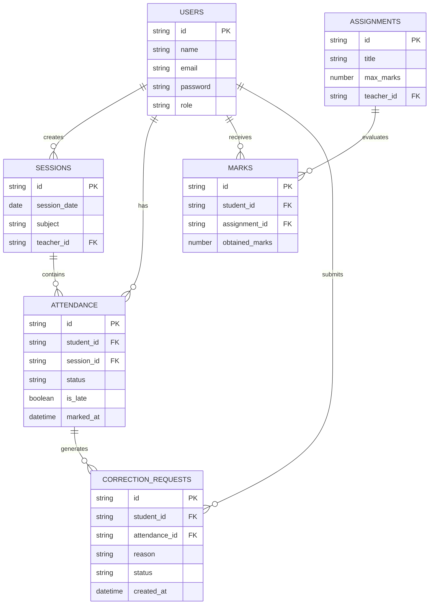

```mermaid
erDiagram

USERS {
  string id PK
  string name
  string email
  string password
  string role
}

SESSIONS {
  string id PK
  date session_date
  string subject
  string teacher_id FK
}

ATTENDANCE {
  string id PK
  string student_id FK
  string session_id FK
  string status
  boolean is_late
  datetime marked_at
}

ASSIGNMENTS {
  string id PK
  string title
  number max_marks
  string teacher_id FK
}

MARKS {
  string id PK
  string student_id FK
  string assignment_id FK
  number obtained_marks
}

CORRECTION_REQUESTS {
  string id PK
  string student_id FK
  string attendance_id FK
  string reason
  string status
  datetime created_at
}

USERS ||--o{ SESSIONS : creates
USERS ||--o{ ATTENDANCE : has
SESSIONS ||--o{ ATTENDANCE : contains
USERS ||--o{ MARKS : receives
ASSIGNMENTS ||--o{ MARKS : evaluates
ATTENDANCE ||--o{ CORRECTION_REQUESTS : generates
USERS ||--o{ CORRECTION_REQUESTS : submits
```