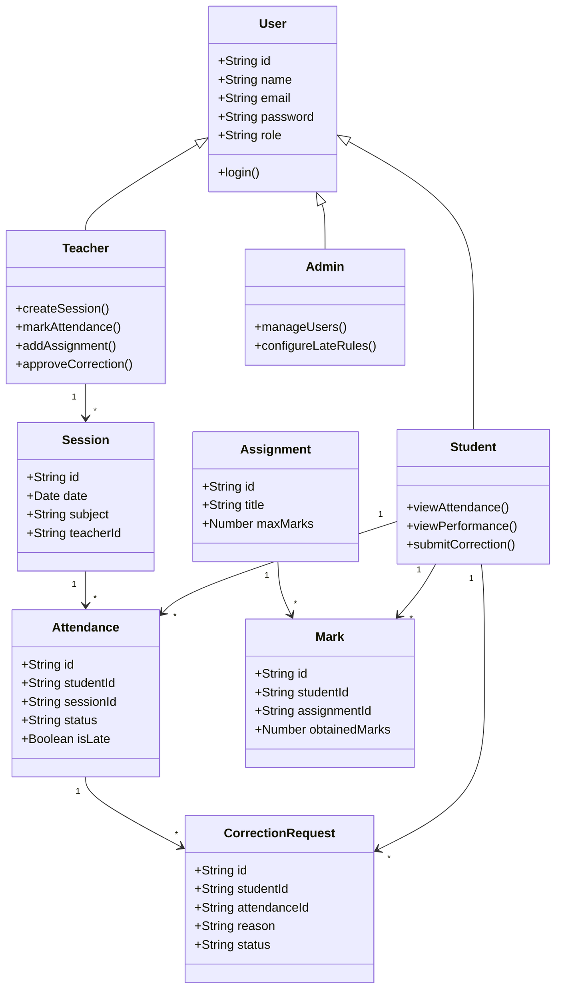

```mermaid
classDiagram

class User {
  +String id
  +String name
  +String email
  +String password
  +String role
  +login()
}

class Student {
  +viewAttendance()
  +viewPerformance()
  +submitCorrection()
}

class Teacher {
  +createSession()
  +markAttendance()
  +addAssignment()
  +approveCorrection()
}

class Admin {
  +manageUsers()
  +configureLateRules()
}

class Session {
  +String id
  +Date date
  +String subject
  +String teacherId
}

class Attendance {
  +String id
  +String studentId
  +String sessionId
  +String status
  +Boolean isLate
}

class Assignment {
  +String id
  +String title
  +Number maxMarks
}

class Mark {
  +String id
  +String studentId
  +String assignmentId
  +Number obtainedMarks
}

class CorrectionRequest {
  +String id
  +String studentId
  +String attendanceId
  +String reason
  +String status
}

User <|-- Student
User <|-- Teacher
User <|-- Admin

Teacher "1" --> "*" Session
Session "1" --> "*" Attendance
Student "1" --> "*" Attendance
Assignment "1" --> "*" Mark
Student "1" --> "*" Mark
Attendance "1" --> "*" CorrectionRequest
Student "1" --> "*" CorrectionRequest
```