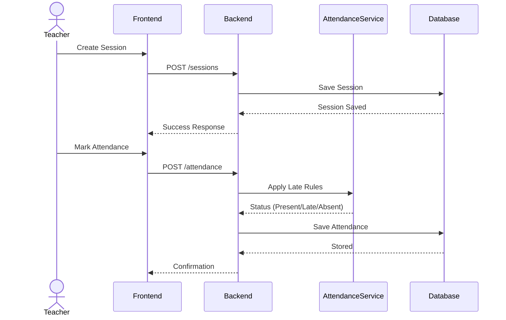

```mermaid
sequenceDiagram

actor Teacher
participant Frontend
participant Backend
participant AttendanceService
participant Database

Teacher->>Frontend: Create Session
Frontend->>Backend: POST /sessions
Backend->>Database: Save Session
Database-->>Backend: Session Saved
Backend-->>Frontend: Success Response

Teacher->>Frontend: Mark Attendance
Frontend->>Backend: POST /attendance
Backend->>AttendanceService: Apply Late Rules
AttendanceService-->>Backend: Status (Present/Late/Absent)
Backend->>Database: Save Attendance
Database-->>Backend: Stored
Backend-->>Frontend: Confirmation
```