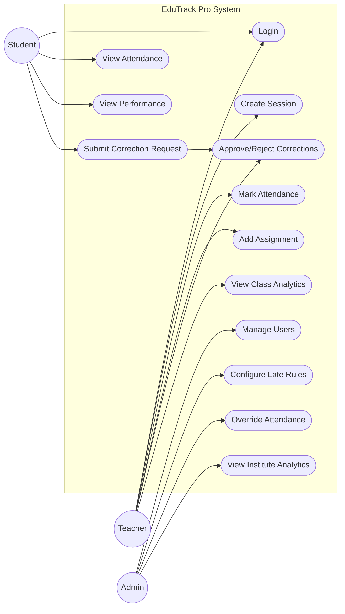

```mermaid
flowchart LR

Student((Student))
Teacher((Teacher))
Admin((Admin))

subgraph EduTrack Pro System

Login([Login])
ViewAttendance([View Attendance])
ViewPerformance([View Performance])
SubmitCorrection([Submit Correction Request])

CreateSession([Create Session])
MarkAttendance([Mark Attendance])
AddAssignment([Add Assignment])
ApproveCorrection([Approve/Reject Corrections])
ViewClassAnalytics([View Class Analytics])

ManageUsers([Manage Users])
ConfigureLateRules([Configure Late Rules])
OverrideAttendance([Override Attendance])
ViewInstituteAnalytics([View Institute Analytics])

end

Student --> Login
Student --> ViewAttendance
Student --> ViewPerformance
Student --> SubmitCorrection

Teacher --> Login
Teacher --> CreateSession
Teacher --> MarkAttendance
Teacher --> AddAssignment
Teacher --> ApproveCorrection
Teacher --> ViewClassAnalytics

Admin --> ManageUsers
Admin --> ConfigureLateRules
Admin --> OverrideAttendance
Admin --> ViewInstituteAnalytics

SubmitCorrection --> ApproveCorrection
```